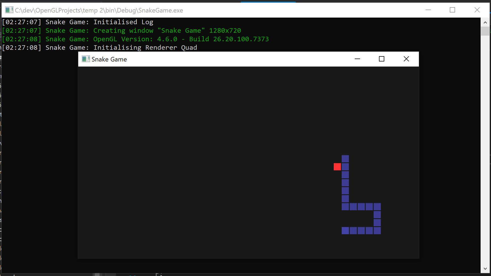
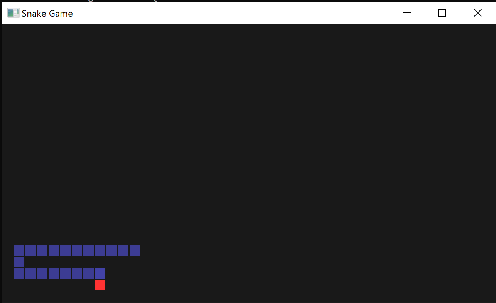

# SnakeGame
**About:**  
Built a simplistic snake game using OpenGl in C++. The window was created using GLFW library. Even though it's a simple game, the code has a layer stack and all window events are processed and dispatched. The renderer also supports a very basic form of batch rendering. The snake and the food are all batched and rendered in one draw call per frame. 

**Instructions:**  
Use the Arrow keys to move.   
Use Space to pause the game.  
Use 'R' key to restart.  

**Images:**  

  

